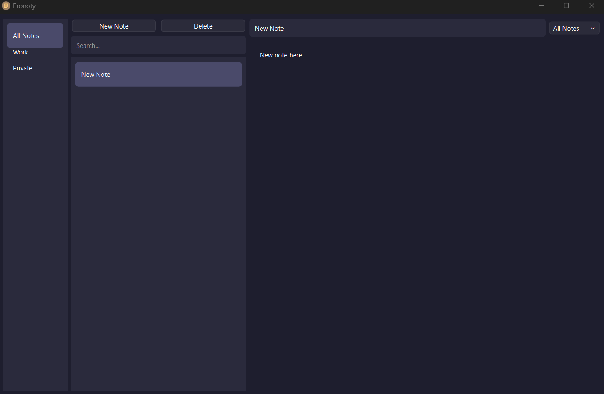
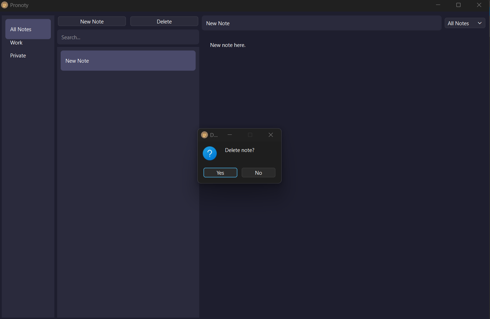
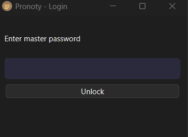

# Pronoty

Pronoty is a secure desktop note-taking application built with Python and PySide6.  
It stores all data locally and encrypts notes using strong cryptography.

## Features

- Local storage (no cloud)
- Encrypted notes (Fernet + PBKDF2)
- Master password (bcrypt)
- Create, edit, delete notes
- Categories / folders
- Search notes
- Auto-save
- Pin / unpin notes
- Modern GUI (Qt)

## Security

- Password hashing: bcrypt
- Key derivation: PBKDF2 (390,000 iterations)
- Encryption: Fernet (AES-based)
- Separation of authentication and encryption

## Tech Stack

- Python 3
- PySide6 (Qt)
- SQLite
- cryptography
- bcrypt

## Run locally

pip install -r requirements.txt  
python app.py

## Build EXE

pyinstaller --noconfirm --onefile --windowed --icon=assets/pronoty.ico app.py

## Project Structure

core/
    auth_manager.py
    crypto_manager.py
    database.py
    notes_manager.py

ui/
    main_window.py
    login_window.py

assets/
data/
app.py

## Screenshots

  
  

## Notes

- Data is stored locally in the `data/` folder
- Do not share your master password